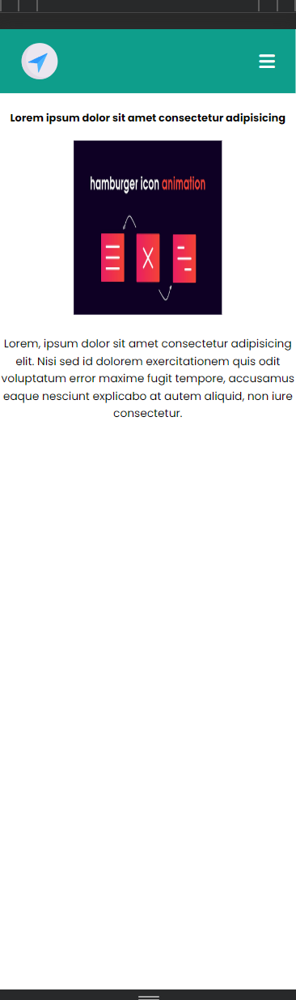
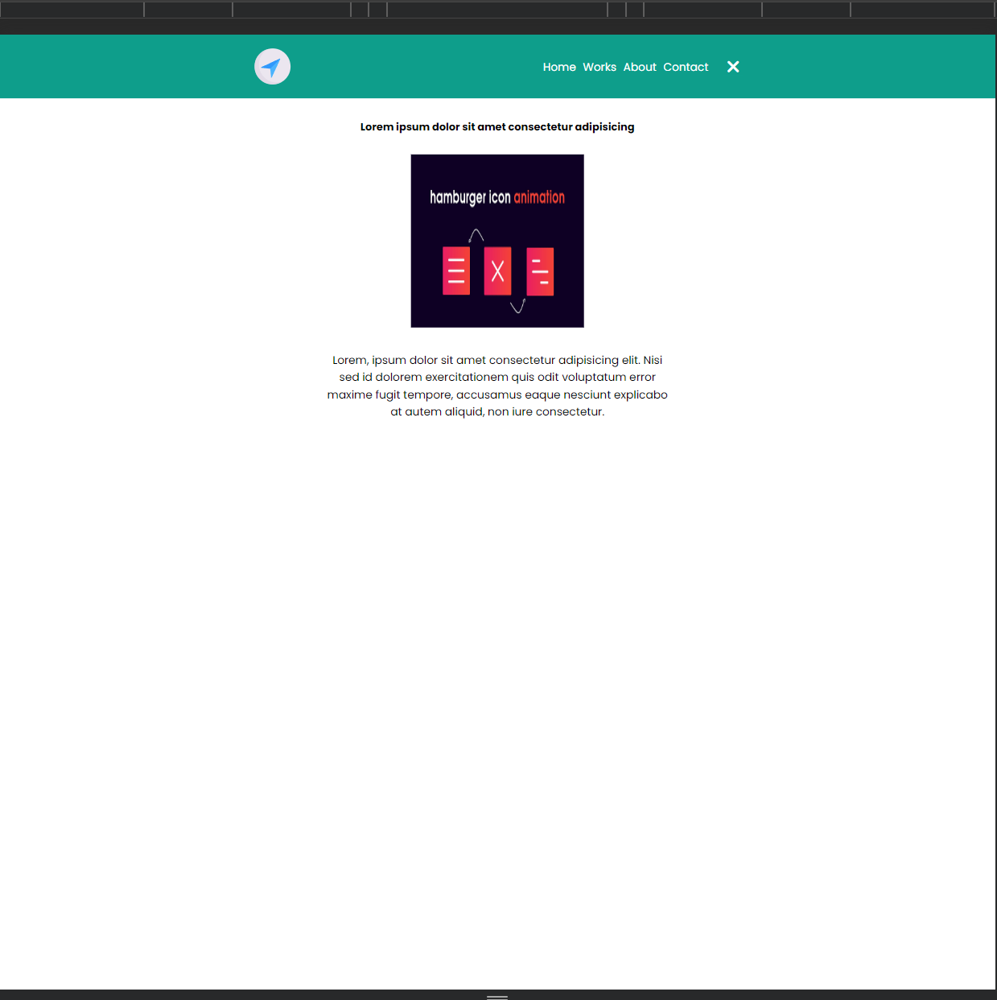

<!-- TABLE OF CONTENTS -->

# 📗 Table of Contents

- [📖 About the Project](#about-project)
  - [🛠 Built With](#built-with)
    - [Tech Stack](#tech-stack)
    - [Key Features](#key-features)
  - [🚀 Live Demo](#live-demo)
- [👥 Authors](#authors)
- [🤝 Contributing](#contributing)
- [⭐️ Show your support](#support)
- [🙏 Acknowledgements](#acknowledgements)
- [📩 Support & Feedback](#support)
- [📝 License](#license)

<!-- PROJECT DESCRIPTION -->

# 📖 About This Project 

> Animated-Navigation is a website created with HTML, SCSS, and TypeScript. It utilizes TSLint for code error detection and maintaining clean code practices. Feel free to check out the live demo for an interactive experience.

# Sample Of Website 

## 🛠 Built With 

### Tech Stack 

  
Client

  <ul>
  <li><a href="https://en.wikipedia.org/wiki/HTML">Html</a></li>
  <li><a href="https://en.wikipedia.org/wiki/CSS">Css</a></li>
  <li><a href="https://en.wikipedia.org/wiki/Sass_(style_sheet_language)">Scss</a></li>
  <li><a href="https://en.wikipedia.org/wiki/JavaScript">Javascript</a></li>
  <li><a href="https://en.wikipedia.org/wiki/TypeScript">TypeScript</a></li>
  <li><a href="https://stylelint.io/">Html/CSS Linters</a></li>
  <li><a href="https://eslint.org/">eslinters/TsLinters</a></li>
  </ul>

<!-- Features -->

### Key Features 

- **[Responsive Website]**
- **[Flex & Grid]**
- **[SCSS ]**
- **[TypeScript ]**
- **[Linters ]**
- **[Tslint ]**

(<a href="#readme-top">back to top</a>)

<!-- LIVE DEMO -->

## 🚀 Live Demo 

> Add a link to your deployed project.

- [Live Demo Link](https://ameer2000mzori.github.io/Animated-Navigation/src/)

(<a href="#readme-top">back to top</a>)

<!-- AUTHORS -->

## 👥 Authors 

👤 **Author1**

- GitHub: [@Ameer2000Mzori](https://github.com/Ameer2000Mzori)
- LinkedIn: [Ameer Ameen](https://www.linkedin.com/in/ameer-ameen-82314425b/)

(<a href="#readme-top">back to top</a>)

<!-- CONTRIBUTING -->

## 🤝 Contributing 

Contributions, issues, and feature requests are welcome! please dont forget to contact ameerapex496@gmail.com

Feel free to check the [issues page](../../issues/).

(<a href="#readme-top">back to top</a>)

<!-- SUPPORT -->

## ⭐️ Show your support 

If you like this project, don't hesitate to give it a star 😊.

(<a href="#readme-top">back to top</a>)

<!-- ACKNOWLEDGEMENTS -->

## 🙏 Acknowledgments 

(<a href="#readme-top">back to top</a>)

<!-- Support and feedback -->

## 📩 Support & Feedback 

If you have any feedback, please reach out to me at ameerapex496@gmail.com 📨

(<a href="#readme-top">back to top</a>)

<!-- LICENSE -->

## 📝 License 

This project is [MIT](./LICENSE) licensed.

_NOTE: we recommend using the [MIT license](https://choosealicense.com/licenses/mit/) - you can set it up quickly by [using templates available on GitHub](https://docs.github.com/en/communities/setting-up-your-project-for-healthy-contributions/adding-a-license-to-a-repository). You can also use [any other license](https://choosealicense.com/licenses/) if you wish._

(<a href="#readme-top">back to top</a>)

